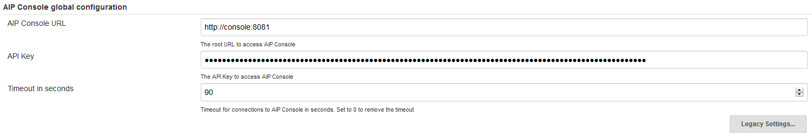
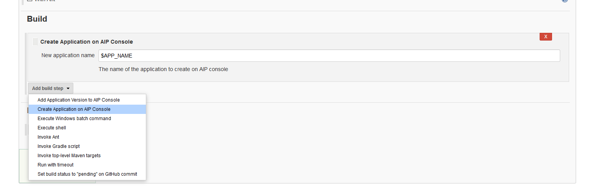
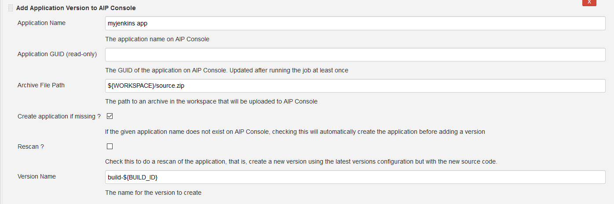

# AIP Console Jenkins Plugin

### Configuration

You can define global settings for the AIP Console Jenkins Plugins. 

Under Manage Jenkins > Configure System > AIP Console global configuration



Here you can define:
* AIP Console URL: The main URL to access AIP Console. If you access the AIP Console UI with, for example, http://my-aip-console:8081/ui/index.html, then the AIP Console URL will be http://my-aip-console:8081. If left blank this will default to http://localhost:8081
* API Key: An API Key, generated inside AIP Console (top right menu). If this option is missing from your AIP Console instance, you can set this field to a user's aip console password and set the `user name` field inside "Legacy Settings"
* Timeout: The default timeout for all exchanges between Jenkins and AIP Console. This can be changed at the Job level as well. 
* User Name: The user name to use for basic authentication. This should only be used if your AIP Console version is 1.9.0 or below.

### Create Application Step

In the "Build" of your job, add a new Build Step, then click "Create Application on AIP Console".



In the step definition, you can either set a fixed value, an environment variable, or a Build Parameter (here, `$APP_NAME` is a build parameter). 

Once you run the job, you'll get the following output :

```
Starting 'Create Application Job'
Job Started, polling status :
Current step of job is Create delivery folder
Current step of job is Create application schemas
Current step of job is Declare application in Management database
Application 'abr_jenkins_test' was created successfully, application guid is : a612338b-79a4-4fc4-9c57-12a98c694d7e
Build step 'Create Application on AIP Console' changed build result to SUCCESS
```

The plugin will create a new application on your target AIP Console instance, and regularly poll the job status until it is either completed, successfully or not.

It'll then show the Application GUID if the newly created application.

You can use this step both with a Freestyle Job and a Pipeline Job.

### Add Version Step 

In the "Build" of your job, add a new Build Step, then click "Add Application version on AIP Console".



You must give an Application Name and a path to a `zip` file as the first 2 parameters.

The application name will be checked on AIP Console, and the application GUID will be obtained this way (it'll be saved in the job configuration and displayed in the read only field Application GUID)

The Zip file will be uploaded to AIP Console, extracted and then run through the whole analysis workflow, as if you had done so through the AIP Console UI.

⚠ *When creating versions for very large applications (above 1Gb of source code), be careful of the timeout configuration, either globally or in your job. As the upload completes, there is a copy operation and depending on your machines specs, it might take more than the default timeout (30s).*

If you check the "Rescan" checkbox, this new version will copy the previous version's configuration (packages, extensions, etc.). 

If you check the "Auto Create" checkbox, when searching for the application name on AIP Console, if it doesn't exists, it'll create it automatically.

If you check the "Ignore failures" check box, the failure of the AIP Console job will not result in a failure of the Jenkins Job. Instead, it'll be marked as unstable, this letting you know of issues without breaking your job.

You can provide a version name. If left empty, the following version will be based on the current date and time and formatted as such: "vyyMMdd.HHmmss"

Here is a sample output of the Add Version step : 

```
Uploading given file to AIP Console
Starting new Add version job
Polling status of Add Version job
Current step of job is Content discovery
Current step of job is Creating version
Current step of job is Creating packages
Current step of job is Attaching packages to version
Current step of job is Delivering version
Current step of job is Accepting Delivery
Current step of job is Importing configuration
Current step of job is Analyzing application
Current step of job is Create snapshot
Current step of job is Consolidate snapshot and publish to Health Dashboard
Analysis of application is completed.
```

NB: Information regarding the creation of the application will also be added to the job output if Auto create is checked and the application does not exist on AIP Console.

As with the Create Application step, you can also use this step in a Pipeline Project:

```
aipAddVersion applicationGuid: 'a2b41b7e-538a-4ec8-8ddf-8ec7baa5a980', filePath: 'source.zip', versionName: '$BUILD_ID'
```

## Development 

### Generating the HPI file

Provided you have Maven installed, you can run the following command 

```bash
mvn package
```

This will generate a `.hpi` file under the `target` directory. You can then add this plugin to your Jenkins instance by going Manage Jenkins > Manage Plugins > Advanced tab and then Upload the `aip-console-jenkins.hpi` file.

### Testing changes to the plugin

Run the following command :

```bash
mvn package hpi:run
```

This will compile the plugin and the start and instance of Jenkins (at http://localhost:8080) where your plugin will be automatically installed. Please refer to the [Jenkins documentation regarding plugin development](https://jenkins.io/doc/developer/plugin-development/) for further details. 