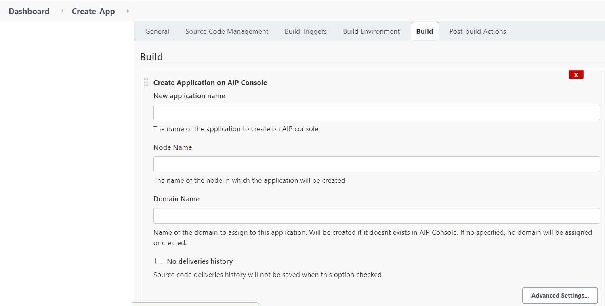
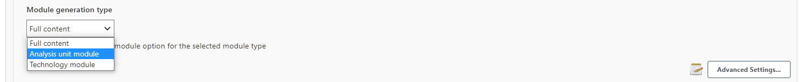
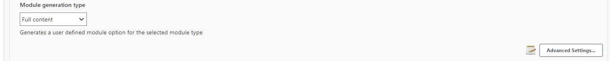

## AIP Console Tools Jenkins Plugin

TODO

### Purpose

This Jenkins Plugin allows you to automate some parts of using AIP Console, like delivering source code, running an application analysis or generating a snapshot through Jenkins.

Pre-Requisites

This plugin requires the following :

* Jenkins version 2.60.3 or above
* An installation of AIP Console that is accessible and configured.
* An API Token for the user that will run the CLI (check [here for details on obtaining a token](https://doc.castsoftware.com/display/AIPCONSOLE/AIP+Console+-+User+Profile+options))

* The ability to generate an archive for your source code OR a configured location in AIP Console where your source will be saved/updated.

### Installation (and Update)

To start using AIP Console Jenkins Plugin, you must first install the plugin in Jenkins.

To do this, you must go to Manage Plugins page of your Jenkins Server.

Then, in the "Advanced" tab, under "Upload Plugin", click "Browse" and select the `aip-console-jenkins.hpi` file.

Click on Upload and Jenkins should install the plugin.

**Updating the plugin is the same process**, but it might require to restart your Jenkins server after installation for the changes to take effect.

#### Configuration

To configure the AIP Console plugin, go to the "Configure System" page in the "Manage Jenkins" page.

On this page, go to the **AIP Console global configuration** section and enter the following required elements :

* *AIP Console URL* : The URL to access the AIP Console server. Make sure that this address is accessible from the
  Jenkins Server and the Jenkins Node that might run the plugin as well.
* *API Key* : The API key that will be used to authenticate to AIP Console.
* *Timeout* : A global timeout setting in seconds before calls to AIP Console will be considered in error.
* *verbose* : If it's checked then AIP Console log output will be display on screen. To hide major information keep this
  unchecked.

#### Using different AIP Console URL and API Key

In case the Job needs to target different AIP Console URL and use a different API Key, it's still possible. To do so,
proceed as follows.

* Create dedicated Job as describe in the next section
* Expand the "Advanced Settings" section and fill fields with desired values.
  

##### Precedence rule

* The value used for AIP Console URL and API Key is always coming from the Job itself when assigned.
* If one field is not assigned then the one from the *Global Configuration* will be used.
### Defining the Analysis Strategy using objectives options

These options can be updated when on-boarding a version using either

* Add Version job
* Deliver Version job.

The enabled options will be added to the existing default ones: **Global Assessment** and **
Function Points measurement**. To Enable/Disable **Blueprint** and **Security assessment** you will need to expand
the **Advanced Settings** of the dedicated job.

### Quick Start

#### Create Application

To create an application, add the `Create application on AIP Console` Step to a job.

In that build step,

* you *must* provide the application name.
* You also optionally have the possibility to decide whether the application should keep the delivered version history
  or not.

* By expanding the "Advanced Settings"
  * You can target a different AIP Console gateway by providing the associated URL and Api Key.
  * You can choose on which CSS Server you which to store your application' data
    

The application will be created on AIP Console after you've run the Jenkins Job.
**Important note**

* When an application is created without the deliveries history then the source code should be located in the Source
  Folder Path sub-folders. This meant no file will not be accepted.

#### Add Version

The `Add Application Version to AIP Console` will create a new version of an application, run an analysis and create a
snapshot of that analysis.
* You can create application when doesn't exist by enabling checkbox.  And only when checked, you will be ask for
  the target CSS server you which to host created application' data on.
  

* You can configure the step to optionaly add the *blueprint objective* to the exising objectives.  
  To do so, check the following option checkbox in the "advanced settings" section
  
* When a snapshot is available, you can optionally decide whether to publish the application to the Health Dashboard or
  not.

  
* You can choose the _Module generation type_ you would like to generate
  
* or just keep the default one that's available on _CAST Console_ (use default).
  

This step requires the following :

* An application name for which a new version will be created. <u>This application must exist in AIP Console</u>.
* A path to a zip or tgz archive file to upload (**NOTE**: you can also provide a folder path; more details in the
  Advanced Usage Section below).

This step will perform the following actions :

* Upload the file `source.zip` to application `my app`
* Create a new version with an automatically generated name
* Run an analysis on this version
* Create a snapshot

This version and the snapshot can be found in the Application's page in AIP Console.

#### Deliver

The `Deliver Source Code to AIP Console` step is similar to the Add version step above.

* You can create application when doesn't exist by enabling checkbox.  And only when checked, you will be ask for
  the target CSS server you which to host created application' data on.
  
* You can configure the step to optionaly add the *blueprint objective* to the exising objectives.  
  To do so, check the following option checkbox in the "advanced settings" section
  

It requires the following :

* An application name for which a new version will be created. <u>This application must exist in AIP Console</u>.
* A path to a zip or tgz archive file to upload (**NOTE**: you can also provide a folder path; more details in the
  Advanced Usage Section below).
* Whether the version should be current or not

This step will perform the following actions :

* Upload the file `source.zip` to application `my app`
* Create a new version with an automatically generated name

The version will be created and visible inside the `Versions` tab of the application in AIP Console.

#### Analyze

The step `Analyze Application on AIP Console` will only run an Application Analysis on AIP Console.

It only <u>requires an Application Name</u>.

But it stills some option that you can set

* You can choose the _Module generation type_ you would like to generate
  
* or just keep the default one that's available on _CAST Console_ (use default).
  

However, note that you <u>need at least one Delivered version on AIP Console</u> for this step to work correctly.

This step will perform the following actions :

* Get the latest version
* Start an analysis on that version

#### Snapshot

The step `Create Snapshot on AIP Console` will create a snapshot for an Application on AIP Console.

It only <u>requires an Application Name</u>.

However, note that you need to have run an Analysis on the Current version for the target Application.

This step will perform the following actions :

* Create a Snapshot
* Generate Snapshot Indicators
* Publish snapshot
* Optionally decided whether to publish the application to the Health Dashboard or not.

The Snapshot can then be found inside the `Snapshot` tab in AIP Console.

### Advanced Usage

The quick start only covers the basic usage of each step of the plugin. The following sections provide greater details on what each parameters changes in the behavior of the AIP Console Tools plugin.
#### A Note on variable expansion

Variable expansion means replacing some variables in text fields to an environment variable value.

For example, creating an application with name "${JOB_NAME} (jenkins)", the Plugin will replace '${JOB_NAME}' with the name of the current running job.
You can use these environment variables on the following fields in each jobs (when defined):

* Application name
* Version name
* Snapshot name
* Node name

You can manually add environment variables to a build or use global jenkins environment variables (see [the jenkins documentation](https://www.jenkins.io/doc/book/pipeline/jenkinsfile/#using-environment-variables))

#### Create Application

The create application provides the following parameters :

* Application name (**required**): The name of the application that will be created in AIP Console
* Node Name (optional): The name of the AIP Node on which the application will be created. If none is specified, AIP Console will pick a node.

Under `Advanced Settings` you will find the following parameters :

* Connection Timeout: Timeout in seconds for each calls to AIP Console.
* Ignore Failure: If checked, if an error occurs when running the step, the job will be marked `UNSTABLE` instead of `FAILED`. This allows running other steps after this one instead of failing the job immediately.

#### Add Version

The Add Version step provides the following parameters :

* *Application Name* (**required**): The name of the application for which a new version will be created.
* *File/Folder path* (**required**): The source code that will be used to create the new version. You can provide either :
  * A File path on the current Jenkins Node to a ZIP, TGZ or TAR.GZ file
  * A Folder Path on the AIP Node relative to the Source Folder Path defined inside AIP Console. For more information, [please see here under Source Folder Location](https://doc.castsoftware.com/display/AIPCONSOLE/Administration+Center+-+Settings) **Requires AIP Console 1.15.0 or above**
* *Create Application if missing*: If checked and the application cannot be found on AIP Console, it will be created. Otherwise, the step will fail.
* *Version Name* (optional): The name of the version that will be created. If left blank, the version will be named with the following pattern : `vYYMMDD.hhmmss` based on date and time.
  * **NOTE**: Any environment variable specified in this field will be expanded. For example, `${BUILD_NUMBER}` will be replaced by the current jobs' build number.
* *Snapshot Name* (optional): The name of the snapshot that will be created, if left blank, the snapshot will be named with date and time
  * **NOTE**: Any environment variable specified in this field will be expanded. For example, `${BUILD_NUMBER}` will be replaced by the current jobs' build number.
* *Rescan*: Clone the previous version of the application (similar to the `Same configuration as previous version` checkbox in the Add Version wizard of AIP Console). If unchecked or no version exists, it will run an Add version job instead.
* *Enable Security Dataflow*: Enabled the Security Objective for this version. Has no effect if `Rescan` is checked.
* *publish the application to the Health Dashboard* (optional): When sets to false, this prevents from consolidating
  snapshot or from publishing application to the Health dashboard. *default* : true 

Under `Advanced Settings` you will find the following parameters :

* Enable backup: Whether a Backup should be created before creating a new version. **Requires AIP Console 1.16.0 or above**
* Name of the backup: The name of the backup **if** Enabled Backup is checked. **Requires AIP Console 1.16.0 or above**
* Ignore Analysis Failure: If checked, if an error occurs when running the step, the job will be marked `UNSTABLE` instead of `FAILED`. This allows running other steps after this one instead of failing the job immediately.
* Node Name (optional): The name of the AIP Node on which the application will be created. If none is specified, AIP Console will pick a node. <u>Only used if `Create Application if missing` is Checked</u>
* Connection Timeout: Timeout in seconds for each calls to AIP Console.
* Publish to Imaging: Publish to Imaging if Imaging is configured with AIP Console

#### Deliver

The Deliver step provides similar parameters to the Add Version step :

* *Application Name* (**required**): The name of the application for which a new version will be created.
* *File/Folder path* (**required**): The source code that will be used to create the new version. You can provide either :
  * A File path on the current Jenkins Node to a ZIP, TGZ or TAR.GZ file
  * A Folder Path on the AIP Node relative to the Source Folder Path defined inside AIP Console. For more information, [please see here under Source Folder Location](https://doc.castsoftware.com/display/AIPCONSOLE/Administration+Center+-+Settings) **Requires AIP Console 1.15.0 or above**
* *Create Application if missing*: If checked and the application cannot be found on AIP Console, it will be created. Otherwise, the step will fail.
* *Automatic discovery* : will discover new technologies and install new extensions during rescan
  * **NOTE**: Uncheck this option if run consistency check
* *Exclusion patterns* : File patterns to exclude in the delivery, the pattern needs to follow the syntax of [glob patterns](https://www.malikbrowne.com/blog/a-beginners-guide-glob-patterns)
* *Version Name* (optional): The name of the version that will be created. If left blank, the version will be named with
  the following pattern : `vYYMMDD.hhmmss` based on date and time.
  * **NOTE**: Any environment variable specified in this field will be expanded. For example, `${BUILD_NUMBER}` will be
    replaced by the current jobs' build number.
* *Make version current* (optional): When checked then the version is used as being the current, and it is made ready to
  analyze.  
  
* *Copy configuration from previous version*: Clone the previous version of the application (similar to
  the `Same configuration as previous version` checkbox in the Add Version wizard of AIP Console). If unchecked or no
  version exists, it will run an Add version job instead.
* *Enable Security Dataflow*: Enabled the Security Objective for this version. Has no effect if `Rescan` is checked.

Under `Advanced Settings` you will find the following parameters :

* Enable backup: Whether a Backup should be created before creating a new version. **Requires AIP Console 1.16.0 or above**
* Name of the backup: The name of the backup **if** Enabled Backup is checked. **Requires AIP Console 1.16.0 or above**
* Ignore Analysis Failure: If checked, if an error occurs when running the step, the job will be marked `UNSTABLE` instead of `FAILED`. This allows running other steps after this one instead of failing the job immediately.
* Node Name (optional): The name of the AIP Node on which the application will be created. If none is specified, AIP Console will pick a node. <u>Only used if `Create Application if missing` is Checked</u>
* Connection Timeout: Timeout in seconds for each calls to AIP Console.

#### Analyze

The Analyze step provides the following parameters :

* *Application Name* (**required**): The name of the application for which the analysis will be run.
* *Version Name* (optional): The name of the version to Analyze. <u>If left blank</u>, the analyzed version will <u>be the latest Delivered Version</u>. If no new Delivered Version Exists, <u>it will use the Current Version</u>.
* *Snapshot*: Whether Snapshots should be created after Analysis.
* *publish the application to the Health Dashboard* (optional): When sets to false, this prevents from consolidating
  snapshot or from publishing application to the Health dashboard. *default* : true

Under `Advanced Settings` you will find the following parameters :

* Ignore Failure: If checked, if an error occurs when running the step, the job will be marked `UNSTABLE` instead of `FAILED`. This allows running other steps after this one instead of failing the job immediately.
* Connection Timeout: Timeout in seconds for each calls to AIP Console.

#### Snapshot

The Snapshot step provides the following parameters :

* *Application Name* (**required**): The name of the application for which the analysis will be run.
* *Snapshot Name* (optional): The name of the Snapshot to create. If left blank, the snapshot will be named with the following pattern: `Snapshot-YYYY-MM-DDThh-mm-ss` depending on current date and time.
* *publish the application to the Health Dashboard* (optional): When sets to false, this prevents from consolidating
  snapshot or from publishing application to the Health dashboard. *default* : true

Under `Advanced Settings` you will find the following parameters :

* Ignore Failure: If checked, if an error occurs when running the step, the job will be marked `UNSTABLE` instead of `FAILED`. This allows running other steps after this one instead of failing the job immediately.
* Connection Timeout: Timeout in seconds for each calls to AIP Console.

### Other Topics

#### Authentication with username

If you cannot use an API Key for authentication to AIP Console, you can provide a username/password combo.

To do this, go to the **Configure System** page of Jenkins, under **AIP Console GLobal Configuration**, click on the Advanced Settings button.

You should see a Username field. Enter the username there and it's password in the API Key field.

Authentication will then be done using this username/password combo.

**Note that this is not advised in production and the API Key should be used instead.**

#### Issues and Logging

If you are facing issues with the AIP Console Jenkins Plugin, you can provide more details to CAST Support or in a Github Ticket by adding a Logger to the Console plugin.

To do this, go to **Manage Jenkins** page and then **System Log**

Click on "Add new log recorder" and provide a unique name. Click Save.

Then click on the Add button in Logger.

Specify `com.castsoftware.aip.console.tools`. Click again on Add and now specify `io.jenkins.plugins.aipconsole`

Click Save.

Go back to the **System Log** page and click on the Log Name you defined previously.

Next time you run a Build using the AIP Console Jenkins Plugin, log messages of all levels should appear here.

#### Pipeline Scripts

TODO: Detail how to run the steps as Pipeline Script elements, and where to find the parameters.