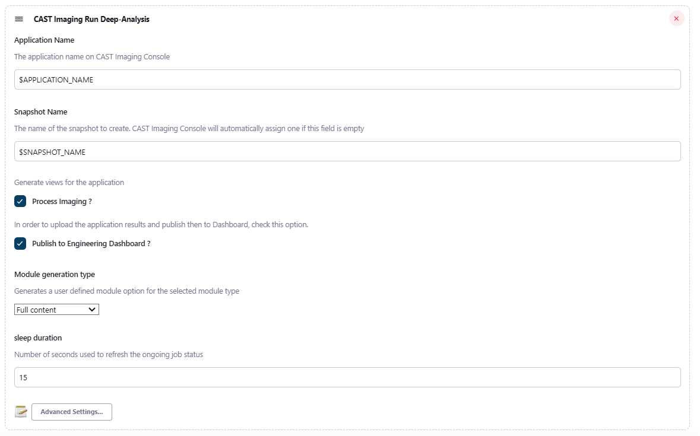

## CAST Imaging Tools Jenkins Plugin

This Jenkins Plugin for CAST Imaging allows users to automate application source code delivery and analysis directly within their CI systems. Most elements that can be configured through the CAST Imaging UI can also be configured when using this plugin in your build configurations.

### Pre-Requisites

This plugin requires the following :

* Jenkins version 2.60.3 or above
* The tools have been tested with JENKINS installation up to **2.387.1**. If you face some issues using higher version of JENKINS, please report to our support team
* The **minimum JAVA** version for running this automation tools is: **17**
* An installation of CAST Imaging 3.X that is accessible and configured.
* A means of Authentication using :
  * For Enterprise installations, an API Token for the user that will run the CLI (
    check [here for details on obtaining a token](https://doc.castsoftware.com/display/AIPCONSOLE/AIP+Console+-+User+Profile+options))

[//]: # (  * For AIP Console Standalone, a username and password. Check the `Authentication with username &#40;AIP Console Standalone&#41;` section in Other Topics, towards the end of this document.)
* The ability to generate an archive for your source code OR a configured location in CAST Imaging where your source will be stored/updated.

### Installation (and Update)

To start using CAST Imaging Jenkins Plugin, you must first install the plugin in Jenkins.

To do this, you must go to Manage Plugins page of your Jenkins Server.


Then, in the "Advanced" tab, under "Upload Plugin", click "Browse" and select the `aip-console-jenkins.hpi` file.

Click on Upload and Jenkins should install the plugin.

**Updating the plugin is the same process**, but it might require to restart your Jenkins server after installation for the changes to take effect.

### Configuration

To configure the CAST Imaging jenkins plugin, go to the "Configure System" page in the "Manage Jenkins" page.


On this page, go to the **Imaging Console global configuration** section and enter the following required elements :

* *Imaging Console URL* : The URL to access the CAST Imaging server. Make sure that this address is accessible from the
  Jenkins Server and the Jenkins Node that might run the plugin as well.
* *API Key* : The API key that will be used to authenticate to CAST Imaging.
* *Timeout* : A global timeout setting in seconds before calls to CAST Imaging will be considered in error.
* *verbose* : When checked, the CAST Imaging logs will also be displayed on the build's log. Uncheck this to prevent displaying the entirety of the CAST Imaging job execution to be displayed during the build.


### Using different Imaging Console URL and API Key

Should you require to target a specific AIP Node instance that differs from the global configuration in Jenkins, you can specify the URL and an API Key by opening the "Advanced Settings" options. Note that you will have to manually set them for each build steps that require targeting a specific CAST Imaging Instance.


The Imaging Console URL and associated API Key specified in the step details will always be used when running a step. In case they are left empty, the global configuration will be used instead.

## Quick Start

The following section will focus on running a job, with the basic required parameters.

#### Onboard Application

Creates an application or uses an existing application to manage source code using a modern on-boarding workflow in CAST Imaging.

This command is used to perform the *Fast scan* or to *refresh* the sources contents before optionally perform a *Deep Analysis* (runs the analysis).

- To perform *Fast Scan/New Scan* operation do select *Console Onboard Application Fast-Scan* step
- To perform *Deep Scan/Run Analysis* operation do select *Console Onboard Application Deep-Analysis* step

**build step**


***job configuration***




## Advanced Usage

This section will provide a detailed look at each parameter available for each type of jobs.

### A Note on variable expansion

Variable expansion means replacing some variables in text fields to an environment variable value.

For example, creating an application with name "${JOB_NAME} (jenkins)", the Plugin will replace '${JOB_NAME}' with the
name of the current running job.
You can use these environment variables on the following fields in each job (when defined):

* Application name
* Version name
* Snapshot name
* Domain Name
* Source File Path
* Upload File Path
* Process Imaging

You can manually add environment variables to a build or use global jenkins environment variables (see [the jenkins documentation](https://www.jenkins.io/doc/book/pipeline/jenkinsfile/#using-environment-variables))

### Deep-Analysis

* *Imaging Console URL*: URL to CAST Imaging should you want to target a different instance that the one specified
  in the global configuration.
* *API Key* : The API Key for the URL specified above.
* *Connection Timeout*: Timeout in seconds for each calls to CAST Imaging.
* *Application Name*: Application on which to perform Deep Analysis.
* *Snapshot Name*: Name of the snapshot. CAST Imaging will automatically assign one to the application if this
  field is empty.
* *Module Generation Type*: How the module generation will be handled by CAST Imaging. Either "Full Content" (default), "
  Analysis Unit module" or "Technology Module".
* *Process Imaging*: If selected, triggers the "Generate Views" step and uploads the application to the Imaging Viewer.
* *Publish to Engineering Dashboard*: In order to upload the application' results and publish then to the Dashboards, check this option.
* *sleep duration* : Amount of seconds used to fetch the ongoing job status (defaulted to **15s**).

### Fast Scan

* *Imaging Console URL*: URL to CAST Imaging should you want to target a different instance that the one specified
  in the global configuration.
* *API Key* : The API Key for the URL specified above.
* *Connection Timeout*: Timeout in seconds for each calls to CAST Imaging.
* *Application Name*: Application on which to perform Deep Analysis.
* *Node Name* : The name of an AIP Node Instance. The field can be left empty and CAST Imagine Console will then assign
  one automatically
* *Domain Name*: The name of the domain to assign when application is created. The field can be left empty and the
  application will go to the default domain.
* *File/Folder path* (**required**): The source code that will be used. You can provide either the file full path or a
  relative path:
  * File full path to a File path on the Jenkins Node where the job will be run: ZIP, TGZ or TAR.GZ file
  * Relative path to the configured Source Folder Location
  * **NOTE**: Any environment variable specified in this field will be expanded. For example, `${WORKSPACE}` will be
    replaced by the current jobs' workspace path.
* *Exclusion patterns* : List of file patterns to exclude in the delivery, separated by a comma. Each patterns need to
  follow the syntax of [glob patterns](https://www.malikbrowne.com/blog/a-beginners-guide-glob-patterns)
* *sleep duration* : Amount of seconds used to fetch the ongoing job status (defaulted to **1s**).

## Other Topics

[//]: # (#### Authentication with username &#40;AIP Console Standalone&#41;)

[//]: # ()
[//]: # (**This section only applies to AIP Console Standalone**)

[//]: # ()
[//]: # (In AIP Console Standalone, authentication doesn't use an API Key as it is not handled by the authentication mechanism.)

[//]: # (Instead, you will have to use username/password combo to interact with AIP Console Standalone.)

[//]: # ()
[//]: # (To do this, go to **Configure System** page of Jenkins, under **AIP Console Global Configuration**, click on the)

[//]: # (Advanced Settings button.)

[//]: # ()
[//]: # (You should see a Username field. Enter the username there and the password in the API Key field.)

[//]: # ()
[//]: # (Authentication will then be done using this username/password combo.)

#### Issues and Logging

If you are facing issues with the CAST Imaging Jenkins Plugin, you can provide more details to CAST Support or in a GitHub Ticket by adding a Logger to the Console plugin.

To do this, go to **Manage Jenkins** page and then **System Log**

Click on "Add new log recorder" and provide a unique name. Click Save.

Then click on the Add button in Logger.

Specify `com.castsoftware.aip.console.tools`. Click again on Add and now specify `io.jenkins.plugins.aipconsole`

Click Save.

Go back to the **System Log** page and click on the Log Name you defined previously.

Next time you run a Build using the CAST Imaging Jenkins Plugin, log messages of all levels should appear here.

#### Pipeline Scripts

Every step defined above can be used in a Pipeline Job or using a Jenkins file.

Rather than detail every step here, you can quickly generate the required syntax using the integrated "Pipeline Syntax" command in Jenkins, to generate a snippet based on a selected step and associated parameters.


You can access this "Pipeline Syntax" page by opening an existing Pipeline job, and click on the "Pipeline syntax" menu item (left side column)


#### Pipeline Sample

Here is an example Pipeline Script :

```groovy
node {
  // Stages to display on the build page
  stage('Preparation') {
    // Get some code from a GitHub repository
    checkout changelog: false, poll: false, scm: [$class: 'GitSCM', branches: [[name: '*/master']], extensions: [[$class: 'RelativeTargetDirectory', relativeTargetDir: 'sources']], userRemoteConfigs: [[url: 'https://github.com/jglick/simple-maven-project-with-tests.git']]]
  }
  stage('Build') {
    dir('sources') {
      sh "git archive -o ../source.zip HEAD"
    }
    aipAddVersion applicationName: 'my jenkins pipeline app', autoCreate: true, cssServerName: '', domainName: '', filePath: 'source.zip'
  }
}
```

This basic pipeline performs the following :
* Initializes a 'Preparation' stage, a visual separator for the different sections of the build
* In this stage, it will retrieve source code using Git from the url to a subdirectory called "sources"
* Initializes a 'Build' stage
* In this stage:
  * It will move to the "sources" folder where the source was checked out.
  * Inside the "sources" folder, the build will call `git archive` to create an archive from the local git repository and save it to the file `source.zip` which it will store in the parent directory
  * Moving back to the parent folder, the build will call `Add Version`, providing an application name, with auto create (`Create application if missing`) set to true and point to the created source.zip file


When running the build, it'll display the progress of each stage visually and show the time to run each stages.

This can be used in existing Jenkins file or new pipeline jobs, to be included in your existing CI workflow.

A more complex example can be found in [the examples' folder's README file](examples/dynamic-pipeline-example/README.md)