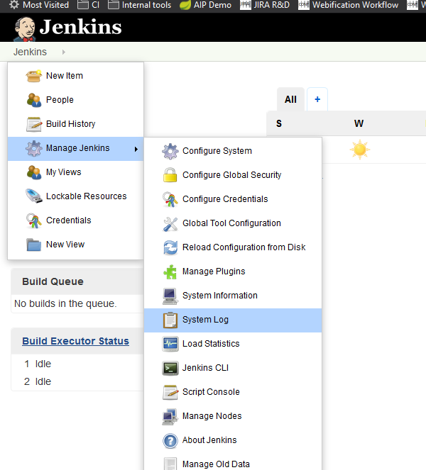
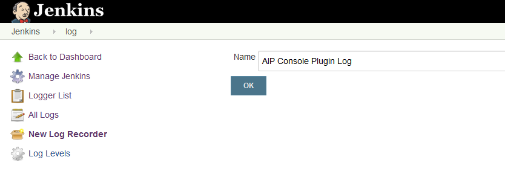
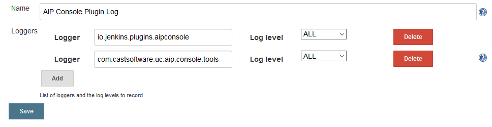
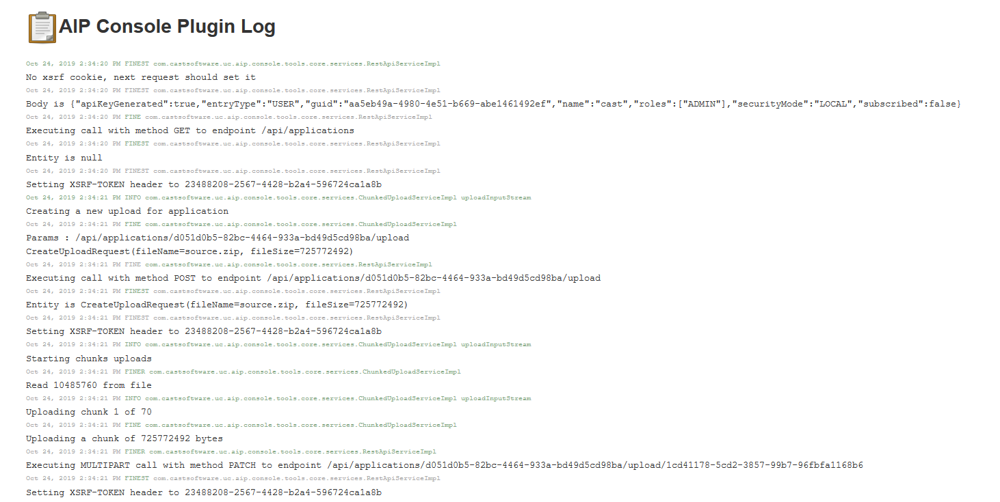

## Jenkins logger for console plugin

This will detail how to add a Logger to check the execution of the AIP Console Jenkins plugin

Manage Jenkins > System Log

On the side : New Log Recorder. Define a name like "AIP Console Plugin Log"

Add 2 Loggers:

* `io.jenkins.plugins.aipconsole` : for the AIP Console plugin "" and one for the AIP Console Tools Core ""
* `com.castsoftware.uc.aip.console.tools` : For the library that handles the calls to AIP Console

**NOTE**: Version 1.0.5 and above no longer have the "uc" package for the core library. So change the logger accordingly with your version of the plugin.

Keep the levels as "ALL"

Validate with Save

Start the job with the plugin, and come back to the Log Viewer (Jenkins > System Log > AIP Console Plugin Log)

Once the Job starts using the AIP Console plugin, the Log page should start showing the messages (refresh the Log page if nothing appears) :

