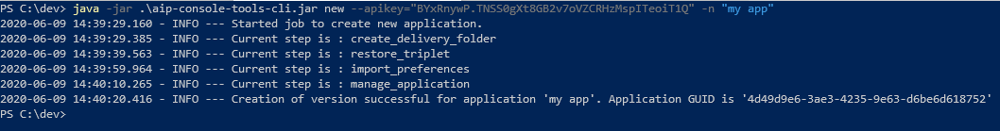
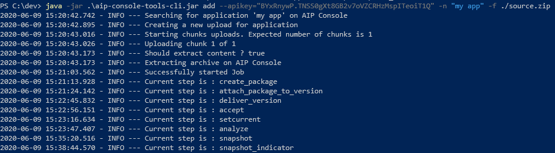
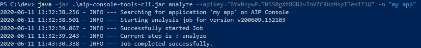

## AIP Console tools CLI

### Objectives

The purpose of the AIP Console Tools CLI is to provide methods to start Application analysis without needing to interact
directly with the AIP Console UI, by leveraging its REST API.

The CLI can create new applications, deliver source code and run application analysis. You can also use this CLI to
import settings file that was exported from the previous version of AIP Console (lower than 2.0.0). For that purpose, a
new command *ImportSettings* with the alias *import* s available (see details below)

### Import settings

Before starting, ensure there is an AIP Console V2 running. From the node installation machine where the exported
settings file is located, do run the below command (to be updated to match your requirements)

- The target server should be the one from V2
- Assume the host machine where AIP Console V2 is running is HOST_V2 and the domain name is *corp.castsoftware.com*
- assume settings file (JSon format) to impoert is *C:/Some-where-on-the-node-machine/exported-test.json*

```bash
java -jar .\aip-console-tools-cli.jar import --apikey="Valid.Api-Key" -s "http://HOST_V2.corp.castsoftware.com:8081" -f="C:/Some-where-on-the-node-machine/exported-test.json"

A final report will be displayed to figure out what really happened.
```

### Requirements

Before using the CLI, you will need a JRE or JDK, version 8 or above. You can use either a JVM provided by Oracle,
AdoptOpenJDK or other validated JVMs (like Amazon Corretto, Azul Zulu, Eclipse OpenJ9, etc.)

You will also need the following :

* An installation of AIP Console that is accessible and configured.
* An API Token for the user that will run the CLI (
  check [here for details on obtaining a token](https://doc.castsoftware.com/display/AIPCONSOLE/AIP+Console+-+User+Profile+options))
* Prepare your source code in one of the two following ways :
    * As a zip or tar.gz archive that will be uploaded to AIP Console
    * As a relative path, pointing to content in the Source Folder location **(SFL)** defined in AIP Console like
      below :


### Defining the Analysis Strategy using objectives options

These options can be updated when on-boarding a version using either

* Add Version command
* Deliver Version command

The enabled options will be added to the existing default ones: **Global Assessment** and **
Function Points measurement**. To Enable/Disable **Data safety investigation** or **Blueprint** and **Security
assessment** you will need to display the help for dedicated command for more details.

### Quick Start
For any of the command line listed bellow, you can use *--verbose* argument to decide whether to display API log information or not.

To **create a new application**, 
* You optionally have the possibility to decide whether the application should keep the delivered version history
    or not:
    set *--no-version-history* argument to match your requirement.

* Whether or not to display log information on screen by setting *--verbose* argument to either true or false.
* You can optionally choose on which CSS server you which to host created application' data. To do so just add either *
  --css-server* or *-css* argument with the name of the desired serve.

**Important note**

* When an application is created without the delivered sources history then the source code should be located the SFL
  sub-folders. This meant no file will not be accepted, and the path provided for versions must be SFL relative path.

run the following :

```bash
java -jar .\aip-console-tools-cli.jar new -n "my app" --apikey="BYxRnywP.TNSS0gXt8GB2v7oVZCRHzMspITeoiT1Q" --verbose=false --no-version-history=false -css="Server-Host:Server-Port"
```

This will create a new application "my app" on my AIP Console instance at `localhost:8081` using my API Key. 
The complete delivered version history will be kept and the API log information will not be displayed.



To **add a new version and analyze its source code**, have a ZIP archive file and use the following command :

```bash
java -jar .\aip-console-tools-cli.jar add --apikey="BYxRnywP.TNSS0gXt8GB2v7oVZCRHzMspITeoiT1Q" -n "my app" -f ./source.zip --verbose=false
```

It will upload the source.zip file, create a new version for the application "my app" and run an analysis on this version. **NOTE** If your application already has versions, this command will *clone* the previous version configuration to run the analysis on the new source code.
* The API log information will not be displayed



To **deliver a new version**, without running the analysis, you can use the following command :

```bash
java -jar .\aip-console-tools-cli.jar deliver --apikey="BYxRnywP.TNSS0gXt8GB2v7oVZCRHzMspITeoiT1Q" -n "my app" -f ./source.zip --verbose=false --set-as-current=true
```

It will upload the source.zip file, and create a new version for the application "my app"
* The API log information will not be displayed
* The version will be used as current and ready to analyze


To **run an analysis on the latest delivered version**, you can use the following command :

```bash
java -jar .\aip-console-tools-cli.jar analyze --apikey="BYxRnywP.TNSS0gXt8GB2v7oVZCRHzMspITeoiT1Q" -n "my app" --verbose=false
```

It will retrieve the latest version of the application "my app", mark that version as current if it isn't, and start an analysis job, without snapshot.
* The API log information will not be displayed



To **deliver a new version** using a **relative folder path**, with source code already updated on the AIP Node server, you can use the following command :

```bash
java -jar .\aip-console-tools-cli.jar deliver --apikey="BYxRnywP.TNSS0gXt8GB2v7oVZCRHzMspITeoiT1Q" -n "my app" -f "my_app_sources/"
```

It will not upload source code, but it will use the source on AIP Node inside the `SourceFolderLocation/my_app_sources` to create a new Version.

### Advanced Usage

When running the CLI, you must specify a command to be run. The list of commands is :

* `CreateApplication` or `new` to create an application on AIP Console
* `AddVersion` or `add` to create a new version and analyze it
* `Deliver` to create a new version **without** running an analysis
* `Analysis` or `analyze` to run an analysis on the current version

Each commands has a `--help` parameter, providing a list of all parameters available.

Below, is a detail of all available parameters for each commands, and how it affects the CLI.

#### CreateApplication

*alias: new*

This command is used to create new applications directly from the CLI from an application name.

The available options are :

- `-n` or `--name` (**required**) : specify the name of the application to create

* `--node-name` (optional) : specify the name of an AIP Node on which the application will be create. *default* : Automatically selected by AIP Console
* `--domain-name` (optional) : specify a domain name to associate with the application to create. *default*: No domain is set for the application.
* `--inplace-mode` (optional):  If true then no history will be kept for delivered sources.
* `--verbose` (optional): Whether the command log should be output to the console or not, defaulted to true
* `--server-url` or `-s` : Specify the URL to your AIP Console server. *default* : localhost:8081
* `--apikey` or `--apikey:env` (either is required) : the API Key to log in to AIP Console **OR** the environment variable containing the key
* `--timeout` (optional) : Time in seconds before calls to AIP Console time out. *default* : 90
* `--user` (optional) (legacy) : Specify a username to log in. Requires passing the user's password in the `--apikey` parameter. *default* : none

#### AddVersion

*alias: add*

This command is used to deliver a new version of an application to AIP Console, run an analysis on it and create a snapshot.

The available options are :

* `--app-name` or `-n` (**required**): The application name.
* `--app-guid` or `-a` (optional): The application GUID. Can replace the application name parameter.
* `--file` or `-f` (**required**): The path to the source code archive (in ZIP or TAR.GZ format) to upload.
* `--auto-create` (optional): Enables automatic creation of application on AIP Console if the application with the given name doesn't exists.
* `--no-clone, `--no-rescan`, `--new-configuration` (optional): Disables cloning a previous version when creating this new version. This is the default behaviour when no version exists for the given application.
* `--version-name` or `-v` (option): The name of the version to create. default: `vYYMMDD.hhmmss`, based on current date and time.
* `--verbose` (optional): Whether the command log should be output to the console or not, defaulted to true
* `--snapshot-name` (option) The name of the snapshot to generate, default will be based on the date and time
* `--enable-security-dataflow` (optional): Enables the Security Dataflow objective for this version. <u>Has no impact when cloning a version</u>.
* `--process-imaging` (optional): Sharing data with the configured Imaging instance linked to AIP Console.
* `--backup` or `-b` (optional): Enables backup creation before delivering a new version.
* `--backup-name` (optional): Specify a name for the backup. <u>Requires the backup parameter to be passed</u>. *default*:
* `--node-name` (optional) : specify the name of an AIP Node on which the application will be create. <u>Has no effect if `--auto-create` is not passed or if application has already been created</u>. *default* : Automatically selected by AIP Console
* `--domain-name` (optional) : specify a domain name to associate with the application to create. <u>Has no effect if `--auto-create` is not passed or if application has already been created</u>. *default*: No domain is set for the application.
* `--server-url` or `-s` : Specify the URL to your AIP Console server. *default* : localhost:8081
* `--apikey` or `--apikey:env` (either is required) : the API Key to log in to AIP Console **OR** the environment variable containing the key
* `--timeout` (optional) : Time in seconds before calls to AIP Console time out. *default* : 90
* `--user` (optional) (legacy) : Specify a username to log in. <u>Requires passing the user's password in the `--apikey`
  parameter</u>. *default* : none
* `--consolidation` or `--upload-application` (optional)  : When sets to false, this prevents from consolidating
  snapshot or from publishing application to the Health dashboard. *default* : false
* `--module-option` (optional) Generates a user defined module option forr either technology module or analysis unit
  module.
  Possible value is one of: full_content, one_per_au, one_per_techno

  *NOTE*: When creating a version, if a previous version exists, it's configuration will be cloned to the new version,
  but the new source will be used for analysis.

#### Deliver

This command is used to deliver a new version of an application to AIP Console. It <u>doesn't</u> marks that version as current by default and won't run an analysis.

The available options are :

* `--app-name` or `-n` (**required**): The application name.
* `--file` or `-f` (**required**): The path to the source code archive (in ZIP or TAR.GZ format) to upload.
* `--auto-create` (optional): Enables automatic creation of application on AIP Console if the application with the given name doesn't exists.
* `--no-clone, `--no-rescan`, `--new-configuration` (optional): Disables cloning a previous version when creating this new version. This is the default behaviour when no version exists for the given application.
* `--version-name` or `-v` (optional): The name of the version to create. default: `vYYMMDD.hhmmss`, based on current date and time.
* `--verbose` (optional): Whether the command log should be output to the console or not, defaulted to true
* `--exclude-patterns` or `-exclude`: File patterns to exclude in the delivery, the pattern needs to follow the syntax of [glob patterns](https://www.malikbrowne.com/blog/a-beginners-guide-glob-patterns)
* `--auto-discover`: will discover new technologies and install new extensions during rescan, to disable when run consistency check
* `--enable-security-dataflow` (optional): Enables the Security Dataflow objective for this version. <u>Has no impact when cloning a version</u>.
* `--backup` or `-b` (optional): Enables backup creation before delivering a new version.
* `--backup-name` (optional): Specify a name for the backup. <u>Requires the backup parameter to be passed</u>. *default*:
* `--node-name` (optional) : specify the name of an AIP Node on which the application will be create. <u>Has no effect if `--auto-create` is not passed or if application has already been created</u>. *default* : Automatically selected by AIP Console
* `--domain-name` (optional) : specify a domain name to associate with the application to create. <u>Has no effect if `--auto-create` is not passed or if application has already been created</u>. *default*: No domain is set for the application.
* `--server-url` or `-s` (optional): Specify the URL to your AIP Console server. *default* : localhost:8081
* `--apikey` or `--apikey:env` (**either is required**) : the API Key to log in to AIP Console **OR** the environment variable containing the key
* `--timeout` (optional) : Time in seconds before calls to AIP Console time out. *default* : 90
* `--user` (optional) (legacy) : Specify a username to log in. <u>Requires passing the user's password in the `--apikey` parameter</u>. *default* : none

#### Analysis

*alias: analyze*

This command is use to run an analysis on a version.

The available options are :

* `--app-name` or `-n` (**required**): The application name.
* `--snapshot` or `-S` (optional): Also runs snapshot creation after analysis.
* `--process-imaging` (optional): If snapshot option is provided, Sharing data with the configured Imaging instance
  linked to AIP Console.
* `--verbose` (optional): Whether the command log should be output to the console or not, defaulted to true
* `--server-url` or `-s` (optional): Specify the URL to your AIP Console server. *default* : localhost:8081
* `--apikey` or `--apikey:env` (**either is required**) : the API Key to log in to AIP Console **OR** the environment
  variable containing the key
* `--timeout` (optional) : Time in seconds before calls to AIP Console time out. *default* : 90
* `--user` (optional) (legacy) : Specify a username to log in. <u>Requires passing the user's password in the `--apikey`
  parameter</u>. *default* : none
* `--consolidation` or `--upload-application` (optional)  : When sets to false, this prevents from consolidating
* `--module-option` (optional) Generates a user defined module option forr either technology module or analysis unit
  module.
  Possible value is one of: full_content, one_per_au, one_per_techno

* snapshot or from publishing application to the Health dashboard. *default* : false

#### Snapshot

This command is used to run a snapshot on an already analyzed version.

The available options are :

* `--app-name` or `-n` (**required**): The application name.
* `--version-name` or `-v` (optional): The name of the version to create. *default*: The current version (version marked as current).
* `--snapshot-name` or `-S` (optional): Used to specify the snapshot name. *default*: Defaults to `Snapshot-YYYY-MM-DDThh-mm-ss` (based on the current date and time)
* `--verbose` (optional): Whether the command log should be output to the console or not, defaulted to true
* `--process-imaging` (optional): Sharing data with the configured Imaging instance linked to AIP Console.
* `--server-url` or `-s` (optional): Specify the URL to your AIP Console server. *default* : localhost:8081
* `--apikey` or `--apikey:env` (**either is required**) : the API Key to log in to AIP Console **OR** the environment variable containing the key
* `--timeout` (optional) : Time in seconds before calls to AIP Console time out. *default* : 90
* `--user` (optional) (legacy) : Specify a username to log in. <u>Requires passing the user's password in the `--apikey` parameter</u>. *default* : none
* `--consolidation` or `--upload-application` (optional)  : When sets to false, this prevents from consolidating
  snapshot or from publishing application to the Health dashboard. *default* : false

### Return Codes

When AIP Console finishes execution, it will return a specific return code, based on the execution.

Here is a detailed list of all error codes that can be returned by the CLI :

* 0 : No errors, processing was completed correctly. This is also the return code for`--help` and `--version` parameters.
* 1 : API key missing. No API key was provided either in the prompt or in the environment variable.
* 2 : Login Error. Unable to login to AIP Console with the given API key. Please check that you provide the proper value.
* 3 : Upload Error. An error occurred during upload to AIP Console. Check the standard output to see more details.
* 4 : Add Version Job Error. Creation of the Add Version job failed, or AIP CLI is unable to get the status of the running job. Please see the standard output for more details regarding this error.
* 5 : Job terminated. The Add Version job did not finish in an expected state. Check the standard output or AIP Console for more details about the state of the job.
* 6 : Application name or GUID missing. The AddVersion job cannot run due to a missing application name or missing application guid.
* 7 : Application Not Found. The given Application Name or GUID could not be found.
* 8 : Source Folder Not Found. THe given source folder could not be found on the AIP Node where the application version is delivered
* 9 : No Version. Application has no version and the provided command cannot be run.
* 10 : Version Not Found. The given version could not be found OR no version matches the requested command (i.e. No delivered version exists to be used for analysis)
* 1000 : Unexpected error. This can occur for various reasons, and the standard output should be checked for more information.

### Authentication

As detailed in the AIP Console documentation, you can obtain the API Key from the profile in the AIP Console UI.

If you cannot use an API Key, you can authenticate using username and password, by passing the `--user` flag to a command, and set the user's password in the `--apikey` or set it in an environment variable, which name you'll pass to `--apikey:env`